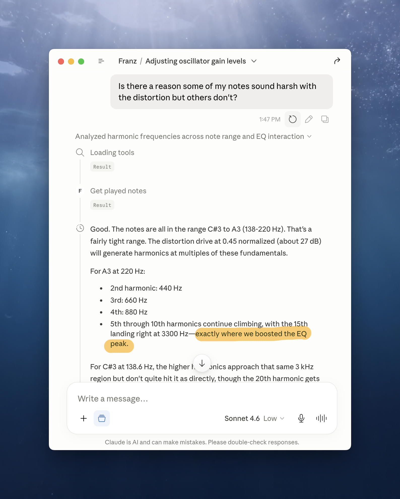

# Franz

A synth sound-design assistant. A musician describes a change in plain language; an LLM
observes the current sound spectrally, reasons about it using a hand-authored signal-flow
document, and surgically adjusts Pigments parameters in Reaper via an MCP server.

Named for Franz Xaver Süssmayr — Mozart's assistant, who completed the *Requiem* after
Mozart died with it unfinished.

## Contributing

Contributions are welcome for new adapters. Right now there is just one DAW (Reaper) and
one synth (Arturia Pigments). Please see the documentation inside the `/adapters/daws/` and
`/adapters/plugins/` folders to understand how to create new adapters, using Reaper and
Pigments as the worked examples.

## License

MIT — see [LICENSE](LICENSE).
