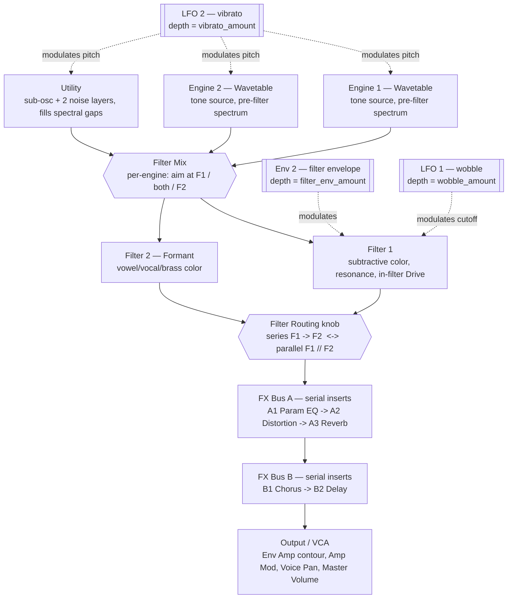

# Pigments Signal-Flow Map

## 0. How to Use This Document

This describes the **signal flow of the Franz base patch** and the **sonic effect of each stage**, so a plain-language request can be translated into a precise parameter move. Every session starts from the same base patch and shapes it by adjusting the exposed parameters. The useful question at each step is "which *stage* do I engage or alter to move the sound this way, and what does that cost elsewhere."

**Division of labor with `vocabulary.yaml`:** that file maps a musician's perceptual words to spectral regions and descriptors (word → spectrum). *This* document maps a spectral region or intent to the stage that owns it and what to weigh when adjusting it (spectrum/intent → stage). It is reasoning context, not a symptom→knob lookup table — apply your own mixing judgment to pick the surgical move.

**Parameters** are referenced by their Pigments **display names**, which bind to ids in `parameters.yaml` (e.g. *F1 Cutoff*, *F1 Drive*, *Engine1 Filter Mix*, *Sub Osc Volume*, *Env Amp Attack*).

**How to read it:** Section 1 is the **authoritative topology** — the Mermaid block is the source of truth for what connects to what and in what order. The prose sections never re-describe the topology; they explain the *sonic effect* of each stage. Where the graph branches (filter routing), one state is active at a time, set by the parameter noted in the legend.

---

## 1. Signal Path Overview

**Legend:**
- **Filter Routing knob:** full CCW = **F1 → F2 series** (Filter 1 feeds Filter 2; cumulative, so Filter 1's Cutoff governs everything downstream); full CW = **F1 // F2 parallel** (each filter processes independently, then sums — preserves more low end, dual-resonance texture); anything between is a genuine blend. Filter Mix (upstream, per engine) decides *what each filter receives*; the routing knob decides *how the two filters combine*.
- **Dotted edges are modulation, not audio** (§3.5). Three fixed routings: **Env 2 → Filter 1 Cutoff** (filter envelope), **LFO 1 → Filter 1 Cutoff** (wobble), **LFO 2 → engine pitch** (vibrato). Each one's **depth is a macro** in `set_movement` (`filter_env_amount` / `wobble_amount` / `vibrato_amount`): **0 = that motion is off and the sound is clean**, higher = more. The shape tools (`set_mod_envelope`, `set_lfo`) set the *character*; the macro sets *how much*.
- **FX Bus B follows Bus A** (Bus A → Bus B) and must be switched on (`bus_b_on`) for its Chorus/Delay to be heard.

Node labels carry a *role*, not a current value — the diagram stays true as the patch morphs.

---

## 2. Sound Engines

**What this stage does to the sound.** The two Wavetable engines plus the permanent Utility engine generate the raw tone and harmonic content. They run in parallel and together define the **pre-filter spectrum** — everything the rest of the synth has to work with. This is where you decide *what the sound fundamentally is* before any shaping, and the first place body and harmonic content get built.

**Engine 1 and Engine 2 — Wavetable.** Wavetable synthesis gives evolving, digital-leaning spectra: the harmonic content is scanned by **Position**, and a built-in modulator oscillator drives FM/phase modulation and wavefolding for added edge and harmonics.
- **Position** — the primary timbre morph; sweeps through the table's frames. Both engines load the **basic waveforms** wavetable, so on this patch Position selects the classic oscillator shapes: **`0.0` = sine, `~0.33` = triangle, `~0.67` = saw, `1.0` = square** (intermediate values blend between them). So "make engine 2 a square" = set `engine2_position` to 1.0; "sine" = 0.0. (This mapping is specific to the loaded wavetable; with a different table, Position still morphs timbre but not these exact shapes.)
- **Fold Amount** and **Phase-Distortion Amount** — add harmonics and edge to the current frame.
- **Mod Vol**, **Mod Amount**, **PM Amount** — the FM/phase-mod modulator oscillator; adds inharmonic or metallic content and complexity.
- **Main Vol**, **Coarse**, **Fine** — level and tuning (detune Engine 2 slightly against Engine 1 for thickness and movement).

**Utility — the sub/noise layer.** A virtual-analog **sub-oscillator** (low-end weight; **Coarse / Fine / Width / Volume / Filter Mix**) plus **Noise 1** and **Noise 2** sample-based sources (air, grit, transient, texture; each with **Coarse / Filter / Length / Loop / Volume / Filter Mix**). Each source has its own Volume — balance them directly.

**Per-engine output.** **Volume**, **On/Off**, and **Filter Mix** (balance knob — full CCW = Filter 1 only, 12 o'clock = both evenly, full CW = Filter 2 only) decide how much of each engine reaches which filter.

**What to consider (non-prescriptive).** Building *weight*, *body*, or *harmonic richness* usually starts here — adding the **Utility sub** for low-end weight, layering the **second engine** (detuned via *Fine* / unison) for thickness, scanning a brighter **Position** or adding **Fold / Phase-Distortion Amount** for more harmonics, or bringing in a **Noise** layer for air/grit/transient. *Where* a layer sits spectrally is decided here; **Filter Mix** then decides which filter's color it receives downstream.

Before adding or cutting, judge whether the region the request points to is **present-but-buried** or **genuinely absent** — this decides between a *rebalance* move and a *build-it-at-the-source* move:
- *Present-but-buried* (the band has energy something else is masking — e.g. a mid lost under low-mid build-up): rebalance what's there (cut the masker, or shape with the filter/EQ).
- *Genuinely absent* (the band has no content): it must be **built here at the source** — no downstream filter or EQ can lift a region that has nothing in it. Adding content here gives the filter and EQ something to shape.

---

## 3. Filter Section

**What this stage does to the sound.** Subtractive and character shaping of the engine spectrum: tonal color, resonant character, and — via Filter 1's **Drive** — in-filter distortion. The two filter slots are **not the same kind of filter**: **Filter 1** is a standard subtractive filter (the patch's main tone-shaper); **Filter 2 is a Formant filter** — a vowel/vocal resonator. They are parallel-capable peers, and which engine reaches which is decided upstream by **Filter Mix**. Filter 1 carries the patch by default; Filter 2 adds a talking/reedy/brass-like color when engaged.

**Filter 1 (subtractive) parameters.** **Cutoff**, **Resonance**, **Drive** (in-filter distortion), **Morph**, **Volume**, **Pan**, **On/Off**. Filter 1's Cutoff is also the destination of the **filter envelope** (Env 2 — see §3.5), so it moves over time, not just where you park it.

**Filter 2 (Formant) parameters.** **Freq Shift** (moves the formant center — vowel openness, darker↔brighter), **Morph** (morphs between vowel shapes — the ah/ee/oo character), **Q Factor** (sharpens the vowel peaks — subtle↔strongly vocal), **Blend** (how hard the formant colors the signal), plus **Volume**, **Pan**, **On/Off**. This is the tool for *vocal*, *talking*, *nasal*, or *reedy/brass-leaning* color — formant peaks are what make a tone read as a voice or a wind instrument. The plain cutoff/resonance/drive of a normal filter do nothing here; shape vowels with these four.

Section-level: the **Filter Routing** knob.

**What to consider (non-prescriptive).**
- **Cutoff** (low-pass) rolls off the engine's high harmonics — so a request for *air* or *brightness* may have nothing to lift if the cutoff already discarded that content; recovering it means reopening Cutoff (which also drags the harsh/sibilant upper bands up with the wanted air) or generating new top-end upstream.
- **Resonance** emphasizes a narrow band around Cutoff — focused presence, or harshness/whistle if pushed.
- **Drive** adds harmonic content at the filter input — it lives in the brightness/harshness territory, not just level, and is the synth's native distortion lever. For "less mud, keep the weight," taming the low-mids with Cutoff/Mode while the engine and sub hold the bottom octave is the structural route; backing off Drive removes harmonics it was generating.
- **Series vs parallel** (routing knob) changes *whether one filter's move cascades*: series when one decision (e.g. one cutoff) should govern everything; parallel when two layers each need their own color preserved.

The filter is the more **structural** tone move; the Param EQ in the FX rack is the more **surgical** one. Pick by ear.

### 3.5 Modulation — movement over time

Most of the stages above set where a knob *sits*. Modulation is what makes the sound *move while a note plays* — and a great many requests ("pluck", "chugging", "wobble", "vibrato", "pump", "snappy", "evolving") are really requests about motion, not a static spectrum. Three modulations are wired into this patch, and each is a **two-part control**: a `set_movement` macro sets **how much** it moves (0 = off → clean), and a shape tool sets **what kind** of movement it is. So **a clean, static sound = all three `set_movement` macros at 0**; to animate, raise the relevant macro and shape the character.

- **Filter envelope — Env 2 → Filter 1 Cutoff** (depth: `filter_env_amount`, shape: `set_mod_envelope`). A second envelope (separate from the amp envelope) sweeps the filter's cutoff over each note — the single most important source of *articulation*: fast attack + short decay + low sustain snaps the filter open then shut for a **pluck** or a **chug** (the tight, percussive movement behind a chugging bass); slow attack makes the tone **bloom/swell** in; high sustain keeps it open and bright. The amp envelope shapes *loudness*; this shapes *brightness over time*.
- **Wobble — LFO 1 → Filter 1 Cutoff** (depth: `wobble_amount`, shape: `set_lfo` wobble_*). A low-frequency oscillator rhythmically sweeps the cutoff — the dubstep "wub". Sync it to tempo for in-time wobble; waveform sets its feel (sine = smooth sweep, square = on/off gate). Off unless `wobble_amount` is up.
- **Vibrato — LFO 2 → engine pitch** (depth: `vibrato_amount`, shape: `set_lfo` vibrato_*). Nudges pitch — **Rate** sets vibrato speed (or sync to tempo), **waveform** its character, **fade** delays it so it blooms in after the note starts, the way a sung note does.

Modulation is the answer when the complaint is about *time and life* rather than *frequency balance* — if a sound is "too static", "lifeless", or "needs to move", raise a movement macro and shape it here. Conversely, if a sound should be **clean, tight, or static**, pull the movement macros to 0 — that is the lever for "clean", not EQ or cutoff.

---

## 4. FX Rack — Bus A & Bus B

**Architecture.** The patch routes the filtered signal into **FX Bus A**, three **serial** insert slots loaded as **A1 Param EQ → A2 Distortion → A3 Reverb**. Each effect starts inert (Dry/Wet at 0) and is **engaged by raising its Dry/Wet** — so all three are available without coloring the sound until you bring one in. **Slot order is load-bearing:** the EQ shapes what reaches the distortion, the distortion drives that shaped signal, and the reverb places the result in a space.

**A1 — Param EQ (the surgical tool).** A five-band fully parametric EQ: **Low shelf, Peak 1, Peak 2, Peak 3, High shelf**, each with **frequency, gain, and Q**, plus a **Scale** master-gain. Because it sits *before* the A2 distortion, cutting a band here stops the distortion from re-exaggerating it — this is exactly the "make the bass less muddy but keep the weight" move: a narrow cut in the low-mids while the sub and low shelf hold the weight. Use it for any localized spectral complaint.

**A2 — Distortion.** **Drive** sets the amount of added upper-harmonic content; **Output Gain** compensates the level. This acts on the already-EQ'd, already-filtered signal — same harmonic territory as the filter's Drive, but later in the chain. Engage via Dry/Wet. It carries its **own built-in filter** (distinct from F1/F2), placeable **Pre** or **Post** the distortion: high-passing *Pre* keeps the low end out of the grit (distort only the upper body, so the bass stays clean and weighty); low-passing *Post* tames the fizz/harshness the distortion adds. A targeted way to control *where* the grit lives without touching the main filters or EQ.

**A3 — Reverb.** Space and tail: **Predelay, Decay, Size, Damping, LowPass, HighPass**, plus Dry/Wet. Last in the chain so earlier processing acts on the dry signal, not the tail. The HighPass keeps low-end weight out of the reverb so the tail doesn't add mud.

**Bus B — Chorus → Delay (modulation & time effects).** A second FX bus follows Bus A, holding two effects Bus A doesn't: **B1 Chorus** (JUN-6 model) and **B2 Delay**. The whole bus is switched with `bus_b_on`; each effect engages via its Dry/Wet.
- **B1 Chorus** thickens and widens — the classic way to make a thin, mono, or static patch sound **lush, wide, and rich** without changing its spectrum. `dry_wet` sets the amount; `rate`/`depth` set the speed and intensity of the shimmer. It's a *width/thickness* tool, complementary to unison/detune (which thicken at the source).
- **B2 Delay** adds **echo, space, and rhythm** — a short feedback is a *slapback* (depth without wash), longer/synced repeats give **dub/ambient** trails. `feedback` sets the number of repeats; `highpass`/`lowpass` darken or thin the echoes so they sit behind the dry signal. Distinct from reverb: delay gives discrete, often rhythmic repeats; reverb gives a continuous wash.

**What to consider (non-prescriptive).** For a localized region, **A1 Param EQ is the precise tool**, and its pre-distortion position makes it the cleanest corrective move. Still weigh it against the **source** (engine content) and the **filter** (Cutoff/Mode/Drive) — building or shaping tone at its origin is often cleaner than correcting downstream. Reach for **A2 Distortion** to add grit/harmonics, **A3 Reverb** for space — each costs something (distortion adds high-mid energy and can re-muddy; reverb adds wash and can blur transients), so bring them in deliberately.

---

## 5. Output / Amp Stage

**What this stage does to the sound.** Per-voice amplitude, stereo placement, and final level, global across both engines. The amplitude envelope (**Env Amp** ADSR) is hardwired to the VCA — its shape *is* the note's volume contour, governing perceived attack and sustain (fast attack / short decay = pluck; slow attack / high sustain = pad).

**Controllable parameters.**
- **Env Amp:** **Attack, Decay, Sustain, Release**, plus **Attack Curve / Decay Curve** (bend the contour — snappy vs soft transients).
- **Master Volume**, **Voice Pan**, **Amp Mod Amount** (modulates output level).
- **Unison** (per engine): **Mode** (Unison / Chord / Super), **Voices**, **Detune**, **Stereo**, on/off — stack detuned voices for width and perceived thickness.
- **Glide** (portamento): pitch slides between notes. A performance/articulation control — *time* set by `glide`, and `glide_mode` chooses every-note vs legato-only sliding. The lever behind *smooth*, *gliding*, and *acid/303-style legato* basses and leads.

**What to consider (non-prescriptive).** The envelope is the lever for *temporal* character — pluck vs swell vs pad — distinct from spectral complaints owned upstream. **Unison / Detune** add width and perceived thickness and shape the stereo image, relating to "size" and fullness without changing the underlying spectrum the way the engines or filter do. Because this stage is global, changes here affect the whole patch at once.

---

## 6. Using This With `vocabulary.yaml`

The intended loop, as context rather than a procedure: the musician's words are resolved by `vocabulary.yaml` into a spectral region or intent; *this* document identifies which stage(s) own that region and what to weigh when adjusting them; and the LLM applies its own mixing judgment to choose the single surgical move that best serves the request. The region anchors and stage notes are diagnostic context to reason *with* — not a prescription table to read an answer *from*.
